# Metro-Aura

A Zune-flavoured firmware for the iPod Classic 6G — the Zune that Microsoft never built for Apple's hardware.

`latest release: v0.7.2` · `GPL v2` · `iPod Classic 6G`

## What it is

Metro-Aura is a fork of [Rockbox](https://www.rockbox.org) that replaces the
whole interface with Microsoft's Metro design language. It takes the Zune 30's
"twist" navigation skeleton — vertical lists with horizontal movement between
pivots, designed for hardware buttons rather than touch — and dresses it in the
Zune HD's visual language: dominant typography, flat colour, tiles, no chrome.

Every screen is drawn by this firmware. Rockbox's menus, list engine, file
browser and skin engine are not used anywhere in the UI.

It runs within what the 6G actually has: a 320×240 screen, 64 MB of RAM, an ARM
CPU with no GPU, and a clickwheel.

## Install

Install it with **[Aura Studio](https://github.com/Ricolinos/Aura-Studio)**, the
desktop app that flashes the firmware and syncs your library. It handles the DFU
steps, the bootloader and dual-boot, so you never need a terminal.

## Highlights

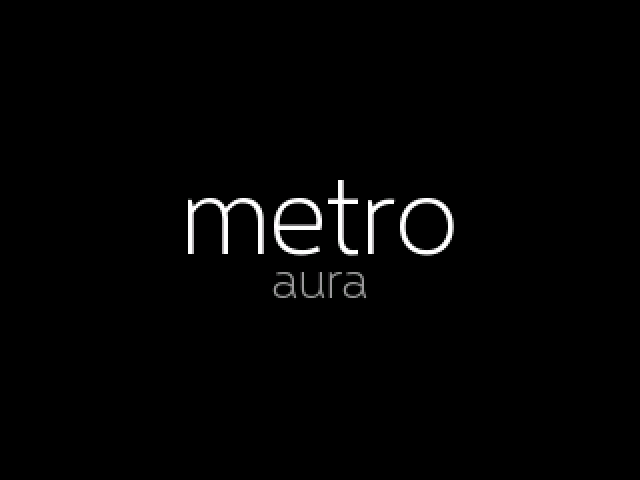

The boot screen: wordmark first, everything else after.

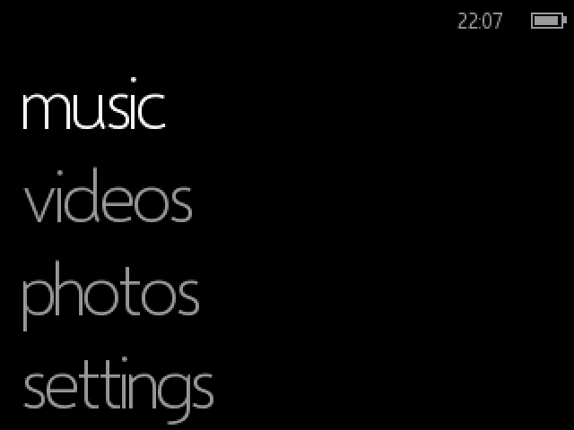

The root menu. Type is the interface — no icons, no boxes, no gradients.

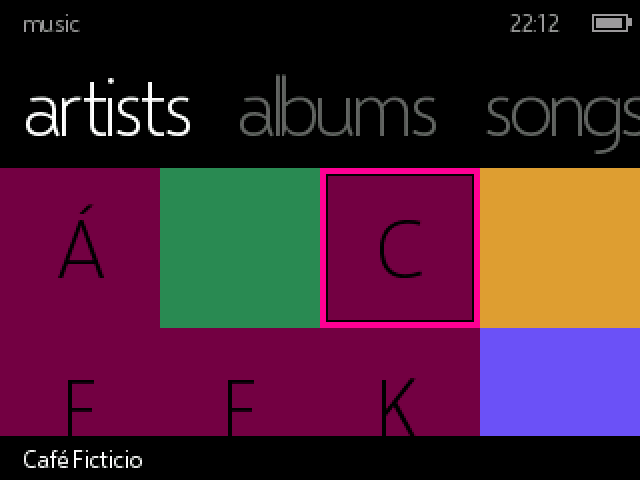

Artists as a grid of tiles. An artist without a photo gets an accent tile with
their initial, in any alphabet.

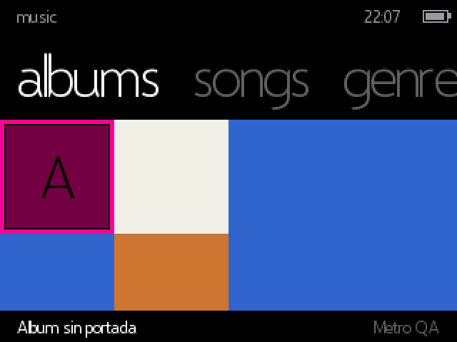

Albums, with real cover art read from your library. Pivots ("albums", "songs",
"genres") scroll horizontally with the wheel.

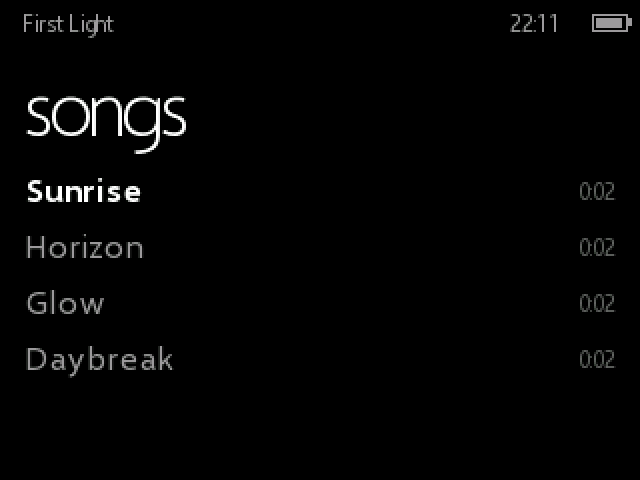

A track list. The selected row scrolls its title if it does not fit; the others
are clipped, so only one thing moves at a time.

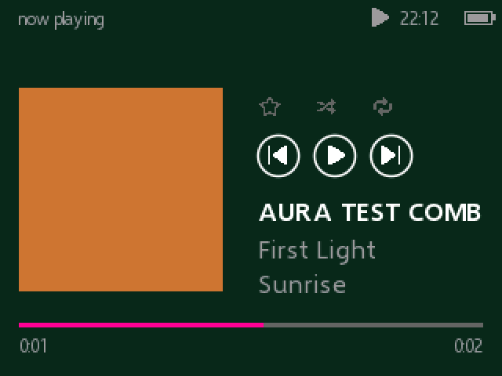

Now Playing, with the album cover as a tile and the artist's photo behind it.

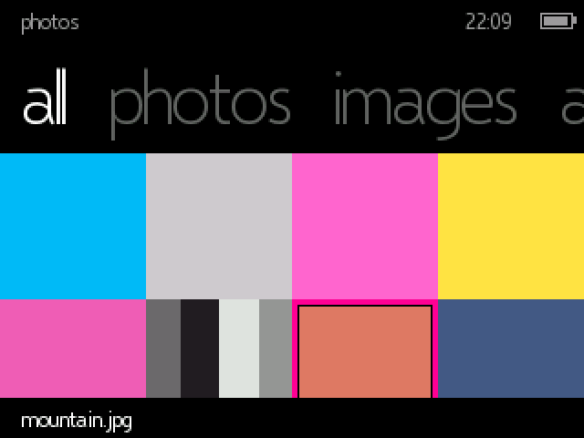

Photos, in a grid of cached thumbnails, filtered by the categories you set in
Aura Studio.

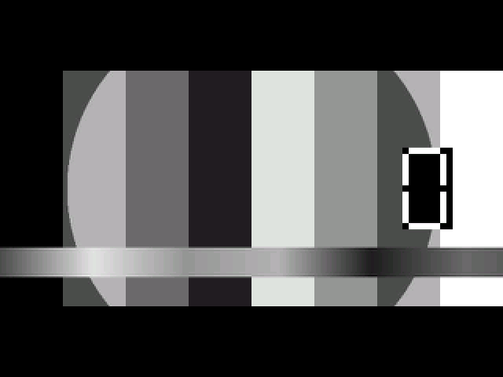

The photo viewer, with fit and fill modes. Spinning the wheel moves through the
album continuously.

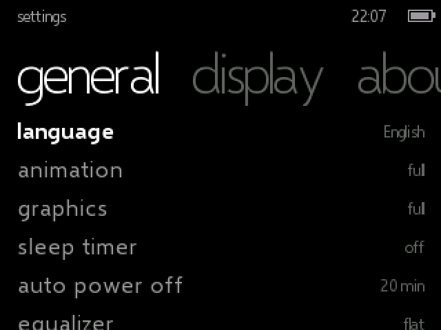

Settings, as pivots rather than nested menus.

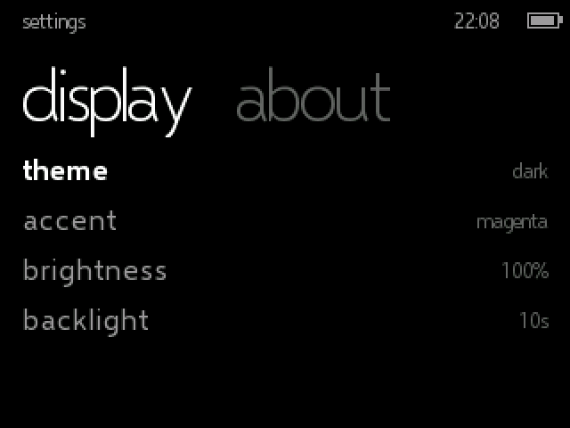

Two themes and ten accent colours.

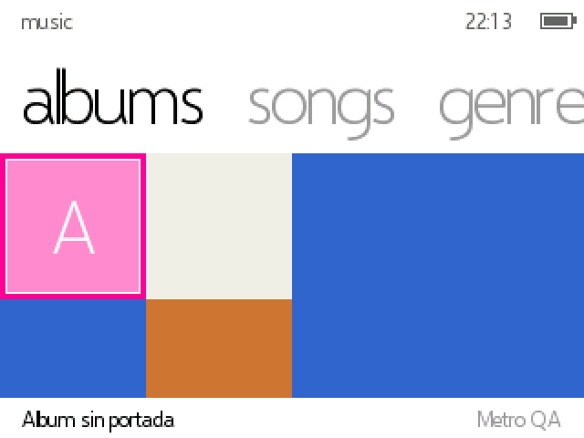

The same album grid in the light theme.

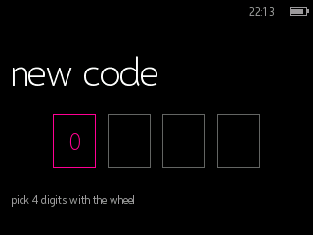

A four-digit screen lock, entered with the wheel and armed by the Hold switch.

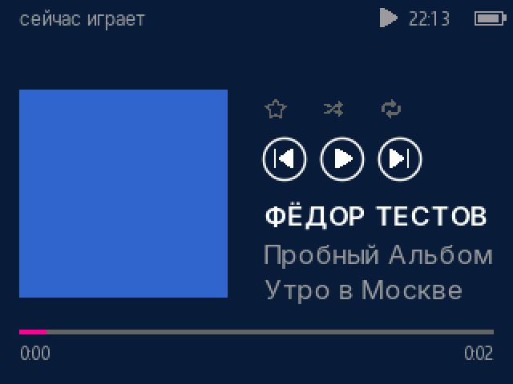

Six languages, including Russian — the Cyrillic is drawn from a separate font,
mixed into the same line as the Latin text.

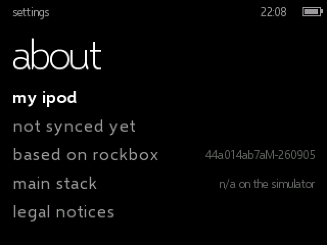

About, with the sync state and the build it came from.

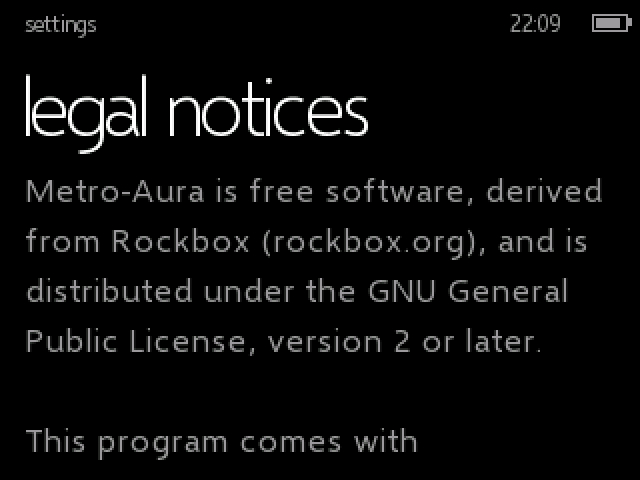

The licence, readable on the device itself.

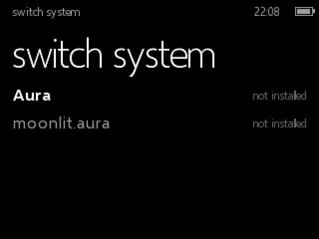

Switching to a sister firmware, from Settings.

> All screenshots are from the SDL simulator, scaled ×2 with nearest-neighbour.
> Every album, artist, track and photo in them is a synthetic test fixture
> generated by `firmware/tools/gen_test_media.sh`.

## Features

- **Six languages** — Spanish, English, French, German, Russian and Italian,
  switchable on the device.
- **Music over tagcache** — artists, albums, songs, genres and playlists, with
  real cover art, artist photos, ratings and synchronised `.lrc` lyrics.
- **Photos and video** — cached thumbnails, a custom viewer with fit/fill, and
  categories defined in Aura Studio.
- **Two themes, ten accents** — plus brightness, backlight timeout, sleep timer,
  auto power off, equalizer, volume limit and clicker.
- **Screen lock** — a four-digit code armed by the Hold switch.
- **Settings shared between firmware families** — language, brightness, volume
  limit, ReplayGain and lock travel with you when you switch firmware.
- **Selective updates** — Aura Studio compares checksums and sends only the
  files that actually changed.
- **A shared cover-art cache** — decoded once, in the background, and reused by
  every screen that needs it.
- **Its own transition engine** — twist, turnstile, fade, feather and continuum,
  at three levels of effect, including off.

## Sister firmwares

Metro-Aura is one of three firmwares that share the same library format and the
same settings file, so you can move between them without resyncing:

- **[Aura](https://github.com/Ricolinos/Aura-Firmware)** — the original.
- **[moonlit.aura](https://github.com/Ricolinos/moonlit-aura)** — a quieter,
  nocturnal take.

Switch from **Settings › switch system**.

## Roadmap

- **Japanese** — kana and jōyō kanji, which need a glyph cache rather than the
  dense font tables the current languages use.
- **More languages**, once that cache exists.
- The open hardware-verification items in `DECISIONS.md`.

## Building from source

See `docs/guia-desarrollo.md`. In short:

```bash
firmware/tools/build_toolchain.sh   # once
firmware/tools/build_sim.sh --run   # SDL simulator, day to day
firmware/tools/build_target.sh      # real ipod6g target + bootloader
firmware/tools/package_dist.sh      # release artefacts
```

Flashing by hand is documented in `docs/GUIA_FLASHEO.md`, but Aura Studio is the
supported path.

## Contributing and decisions

`DECISIONS.md` is the logbook: every decision, why it was made, what it cost and
what was measured. It is the source of truth — the plans under `docs/plans/` are
not. `MODIFICATIONS.md` lists every change to a Rockbox file outside
`apps/metro/`, as GPL v2 §2a requires.

The project documentation is written in Spanish; the code, its comments and the
commit messages are in English.

## License, credits and trademarks

This project is free and open source. The firmware is a fork of
[Rockbox](https://www.rockbox.org) and is released under the GNU General
Public License v2 (see `LICENSE`, `MODIFICATIONS.md` and
`THIRD-PARTY-NOTICES.txt`). Aura Studio is distributed free of charge.

Created and maintained by **Ricolinos**. Rockbox is the work of the Rockbox
community; this project is not affiliated with, endorsed by, or sponsored by
Rockbox, Apple Inc., Microsoft Corporation or moonlit.market.

iPod is a trademark of Apple Inc. Zune, Metro and Windows are trademarks of
Microsoft Corporation. The visual languages of these firmwares are original
interpretations inspired by those designs; they include no proprietary assets
(no SF Pro, SF Symbols, Segoe UI or other proprietary fonts or icons).
Fonts and icons used are licensed under the SIL Open Font License or MIT and
are credited in `THIRD-PARTY-NOTICES.txt`.

Provided "as is", without warranty of any kind. Flashing firmware to a device
is done at your own risk.
